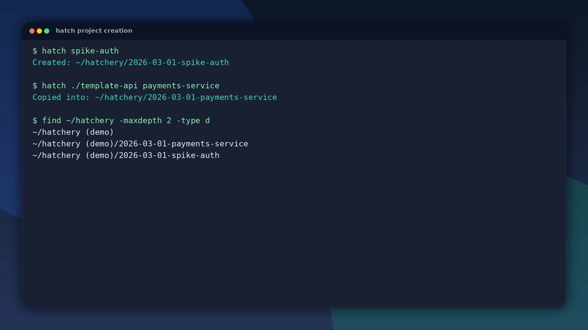
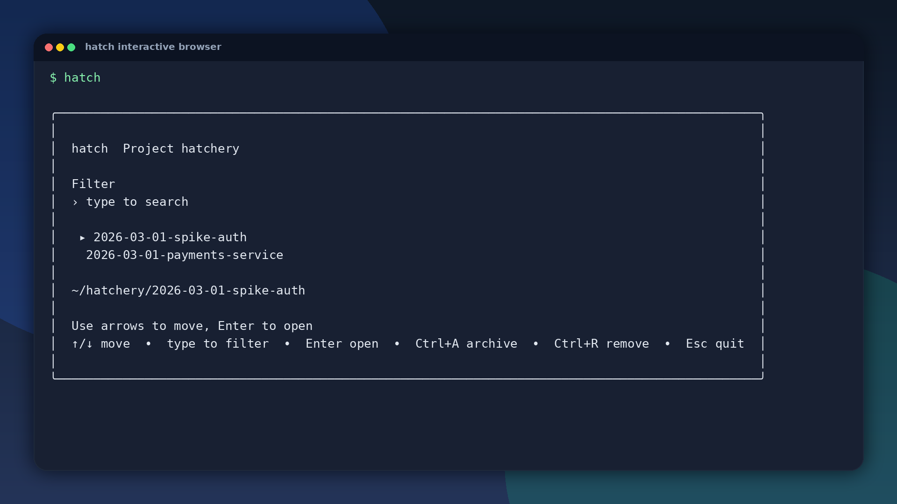

# hatch

`hatch` is a small Go CLI for creating, cloning, and browsing throwaway projects in `~/hatchery`.

## Why this exists

`tobi/try` inspired this workflow. We wanted the same fast project incubation loop with a single static binary and no Ruby runtime.

## Features

- `hatch <name>`: create `~/hatchery/<yyyy-mm-dd>-<name>`
- `hatch <path> <name>`: copy a source directory into `~/hatchery/<yyyy-mm-dd>-<name>`
- `hatch`: interactive browser with live fuzzy filtering
- Browser actions: arrow keys to move, `Enter` to open/create, `Ctrl+A` to archive, `Ctrl+R` to remove
- Shell hook for auto-`cd`

## Screenshots





## Install

### Prebuilt binary

Install with the hosted script:

```bash
curl -fsSL https://raw.githubusercontent.com/nayeemzen/hatch/main/install.sh | sh
```

Pin a specific version:

```bash
curl -fsSL https://raw.githubusercontent.com/nayeemzen/hatch/main/install.sh | VERSION=v0.1.0 sh
```

Install to a custom directory:

```bash
curl -fsSL https://raw.githubusercontent.com/nayeemzen/hatch/main/install.sh | INSTALL_DIR="$HOME/bin" sh
```

Release artifacts are available at:
`https://github.com/nayeemzen/hatch/releases`

### Go install

```bash
go install github.com/nayeemzen/hatch@latest
```

## Shell setup

`hatch` uses a shell hook so the parent shell can `cd` after selection.

### zsh

```bash
eval "$(hatch --init zsh)"
```

### bash

```bash
eval "$(hatch --init bash)"
```

### fish

```fish
hatch --init fish | source
```

## Usage

```bash
hatch --help
```

Examples:

```bash
hatch spike-auth
hatch ~/templates/service-base payment-service
hatch
```

## Development

```bash
go test ./...
```

## License

MIT
